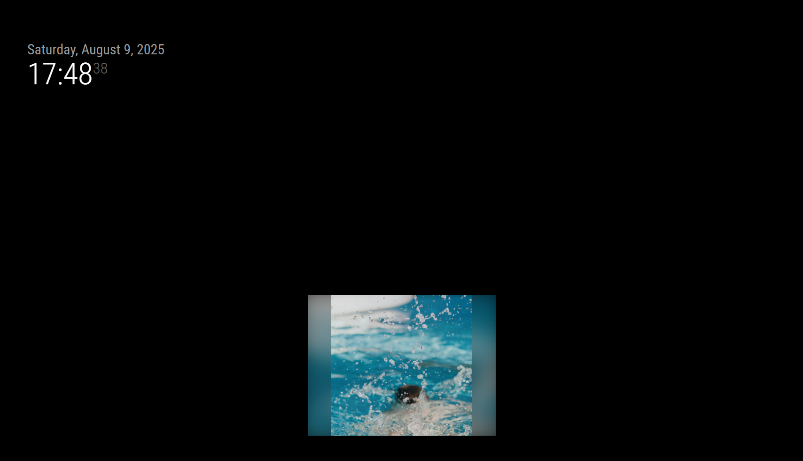
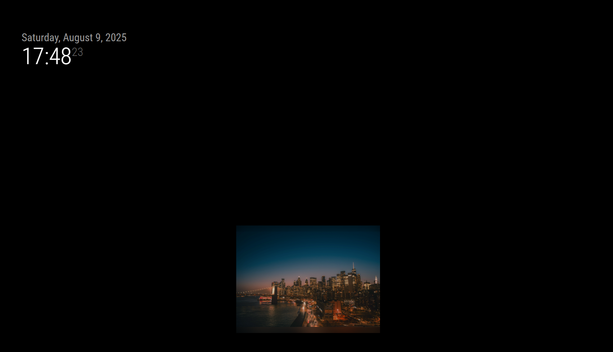

# MMM-PhotoRoll

[](https://magicmirror.builders/)
[](LICENSE)
[](#)
[](#)

A lightweight **MagicMirror²** module to display photos from a local folder.  
Optimized for low-power devices like Raspberry Pi, with **GPU-friendly blurred background support**.

---

## ✨ Features

- 📂 Display images from a local folder (supports subfolders).
- 📁 Defaults to the built-in `uploads/` folder if no `folder` path is set.
- 🖼️ Optional blurred background that fills empty space when the image is smaller than the display area.
- ⚡ Minimal CPU & disk usage:
  - Long-interval folder scanning.
  - No file watchers.
  - Browser-side caching.
- 🗂️ Sort by name, date, or random order.
- 📝 Optional captions (file name under image).
- 📉 Optional server-side thumbnails (requires [`sharp`](https://www.npmjs.com/package/sharp)) to avoid sending huge files.

---

## 📷 Preview

> _Replace these placeholders with your own screenshots_:
>
> 
> 

---

## 🚀 Installation

```bash
cd ~/MagicMirror/modules
git clone https://github.com/SBrendan/MMM-PhotoRoll.git
cd MMM-PhotoRoll

# Optional: install sharp for server-side thumbnails
npm install sharp --omit=dev
````

If you don’t define `folder` in your config, the module will automatically use:

```
modules/MMM-PhotoRoll/uploads
```

This folder will be created automatically if it doesn’t exist.

---

## ⚙️ Configuration

Add to your `config/config.js`:

```js
{
  module: "MMM-PhotoRoll",
  position: "fullscreen_below", // or any region
  config: {
    // folder: "/home/pi/Pictures", // optional – defaults to uploads/ inside module
    recursive: true,             // include subfolders
    allowedExtensions: [".jpg", ".jpeg", ".png", ".webp"],
    sort: "date",                 // "name" | "date" | "random"
    scanInterval: 3600000,        // folder rescan every hour (ms)
    updateInterval: 15000,        // change image every 15s (ms)
    shuffle: false,               // shuffle images client-side
    showCaptions: false,          // display file name under image

    // Stage sizing
    maxWidth: "100%",              // maximum displayed width
    maxHeight: "100%",             // maximum displayed height
    minWidth: "300px",              // minimum width
    minHeight: "300px",             // minimum height
    // aspectRatio: "1 / 1",        // optional, keeps square/ratio

    // Visuals
    fadeSeconds: 0.8,              // fade-in duration
    brightness: 1.0,               // CSS brightness (0.0–1.0)
    rotateDegrees: 0,              // rotate image (0, 90, 180, 270)
    blurBackground: true,          // enable blurred background

    // Thumbnails (requires sharp)
    useThumbnails: false,
    thumbnailMaxWidth: 1280,
    cacheSeconds: 86400            // browser cache time (seconds)
  }
}
```

---

## ⚡ Performance Optimizations

* **Low I/O**: folder scanning only at `scanInterval` (default 1h).
* **No watchers**: avoids continuous disk polling.
* **Browser caching**: `Cache-Control` headers prevent unnecessary reloads.
* **GPU-accelerated**: transitions, rotations, and blur handled by GPU.
* **Optional thumbnails**: with `sharp`, large images are resized server-side.

---

## 🖌️ Blurred Background

When `blurBackground: true`:

* The main image is centered inside a constrained stage (`maxWidth`/`maxHeight`).
* A scaled, blurred copy of the same image fills the stage background.
* If the image is smaller than the stage, the blur fills empty space.
* The blur never overflows the stage area.

---

## 💡 Raspberry Pi Tips

* Prefer `webp` or downscaled JPEGs to reduce memory and bandwidth.
* Install `sharp` and enable `useThumbnails` to avoid sending multi-megapixel files.
* Keep `scanInterval` ≥ 30 min for network/USB folders to save resources.

---

## 📄 License

MIT © 2025 Brendan

---

## 🤝 Contributing

Pull requests are welcome!
If you add features (EXIF captions, transitions, etc.), update the README and include example screenshots.
